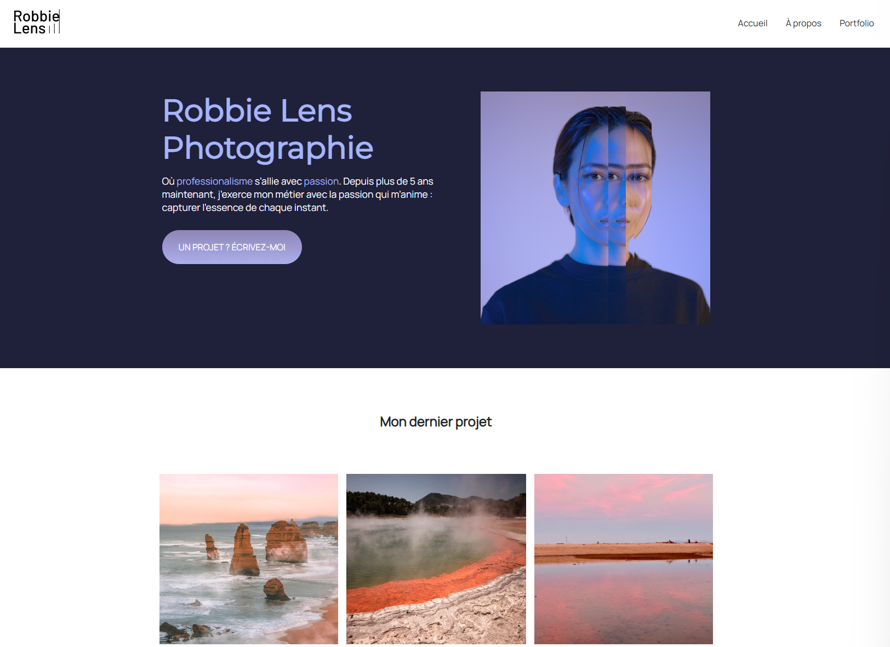

# Site Web Photographe

## Description

Ce projet consiste en la création d'un site web pour un photographe, utilisant principalement HTML et CSS. Le site présente une galerie de photos, une page de présentation, des informations sur les services du photographe, et une page de contact. L'objectif est de créer un design simple, élégant et responsive pour que les visiteurs puissent découvrir le travail du photographe et le contacter facilement.

## Aperçu du projet

Voici à quoi ressemble l'interface du site :



## Fonctionnalités

- **Page d'accueil** : Présentation du photographe avec une mise en avant des meilleures œuvres et un formulaire de contact.
- **Page "à propos"** : Informations sur les services offerts par le photographe (séances photo, retouche d'images, etc.) et une grille des tarifs.
- **page de Portfolio** : Affichage dynamique de photos sous forme de grille.
- **Responsive design** : Le site est optimisé pour tous les types d'appareils (desktop, tablette, mobile).

## Technologies utilisées

- **HTML5** : Structure de base du site.
- **CSS3** : Mise en forme et gestion de la mise en page (grilles, flexbox, animations).
- **Flexbox / Grid** : Techniques de mise en page pour rendre le site responsive et flexible.
- **Media Queries** : Adaptation du design aux différentes tailles d'écran.

## Installation

1. Clonez ce dépôt sur votre machine locale :
   ```bash
   git clone https://github.com/josephDelnord/projet-site-photographe.git
   ```
2. Ouvrez le dossier du projet :

   ```bash
   cd projet-site-photographe
   ```
3. Ouvrez le fichier **index.html** dans votre navigateur préféré pour visualiser le site localement.
